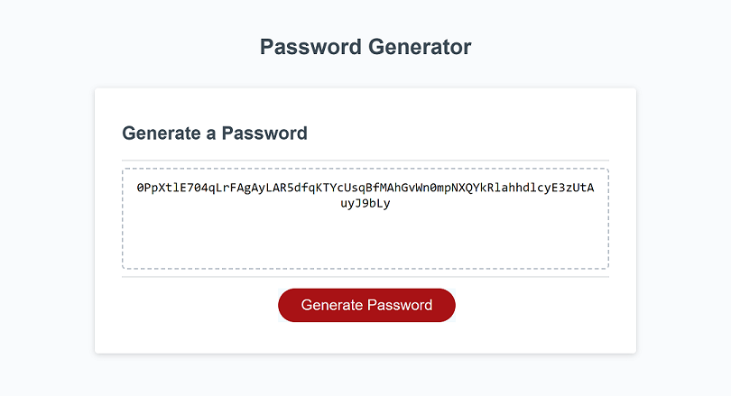

# Challenge 3: Random Password Generator

## Description

With this project, the goal was to create a password generator that would that would give a user several customization options. The user is able to choose character types including:

* Lowercase letters
* Uppercase letters
* Numbers
* Special characters (or symbols)

The user is also able to choose the amount of characters, as long as it's more than 8 and less than 128. It also only allows numbers in this field (no letters, symbols, etc.). When the user clicks 'Generate Password' several pop-ups appear in sequence to have the user select their preferences for password generation.

## User Story

* AS AN employee
* I WANT to randomly generate a password that meets certain criteria
* SO THAT I can create a strong password that provides greater security

## Acceptance Criteria

* GIVEN I need a new, secure password
* WHEN I click the button to generate a password
* THEN I am presented with a series of prompts for password criteria
* WHEN prompted for password criteria
* THEN I select which criteria to include in the password
* WHEN prompted for the length of the password
* THEN I choose a length of at least 8 characters and no more than 128 characters
* WHEN asked for character types to include in the password
* THEN I confirm whether or not to include lowercase, uppercase, numeric, and/or special characters
* WHEN I answer each prompt
* THEN my input should be validated and at least one character type should be selected
* WHEN all prompts are answered
* THEN a password is generated that matches the selected criteria
* WHEN the password is generated
* THEN the password is either displayed in an alert or written the page

## Installation

N/A

## Deployed Application

The deployed application can be found at this link:
https://jsheen98.github.io/coding-bootcamp-challenge-3/

## Assets

The following image demonstrates the website's appearance:

## License

Please refer to the LICENSE in the repo